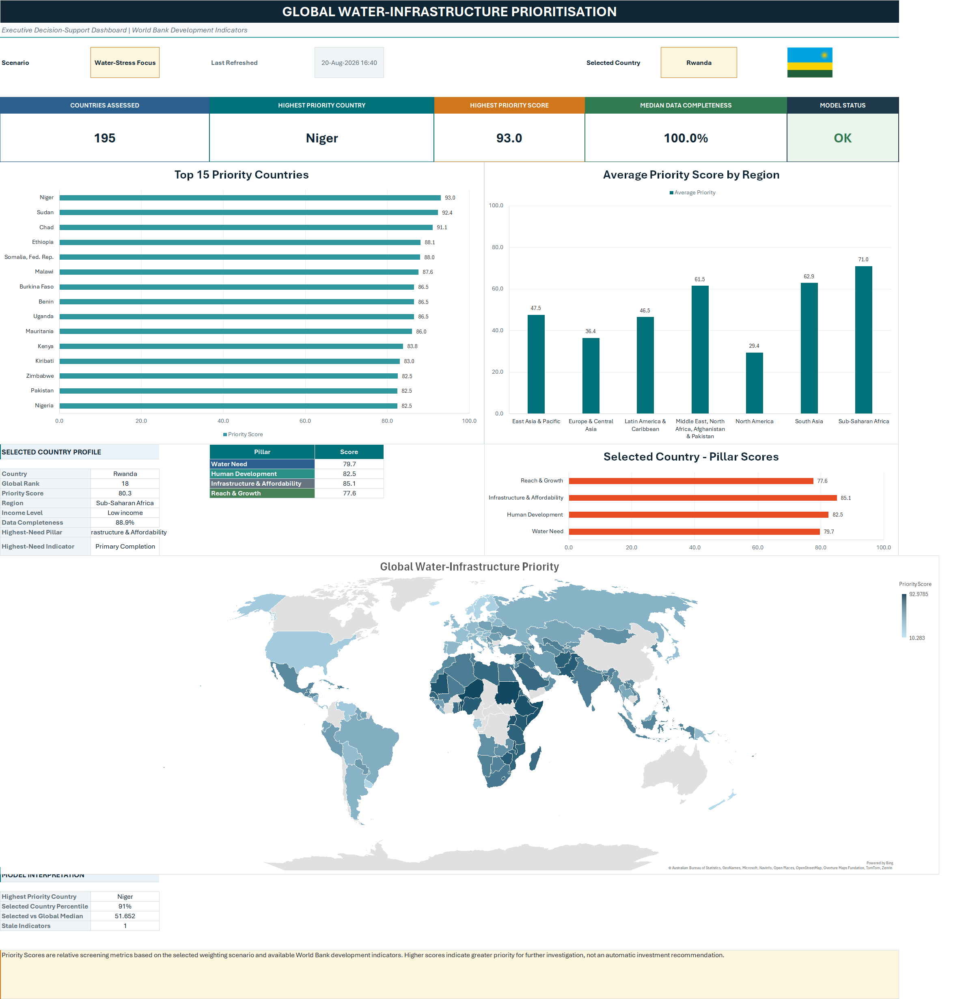
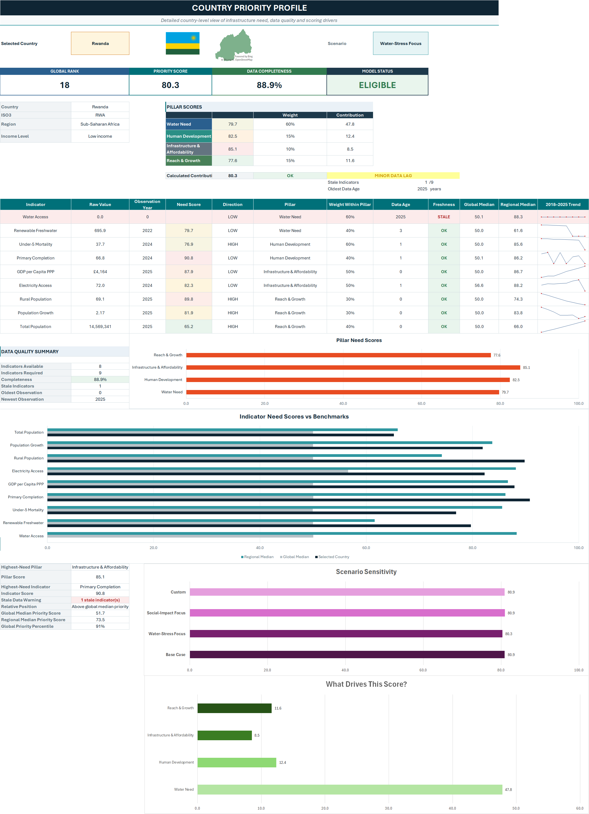
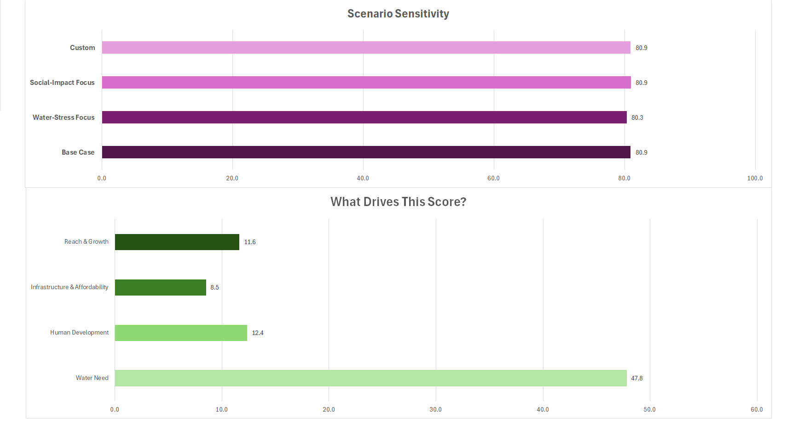
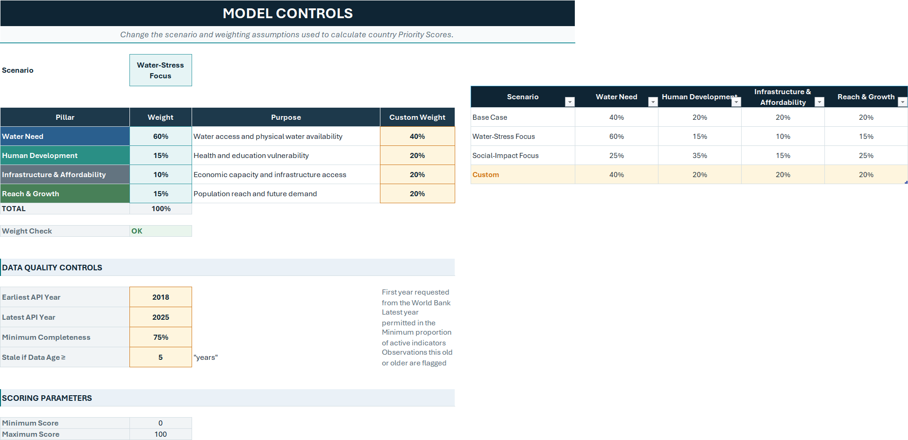
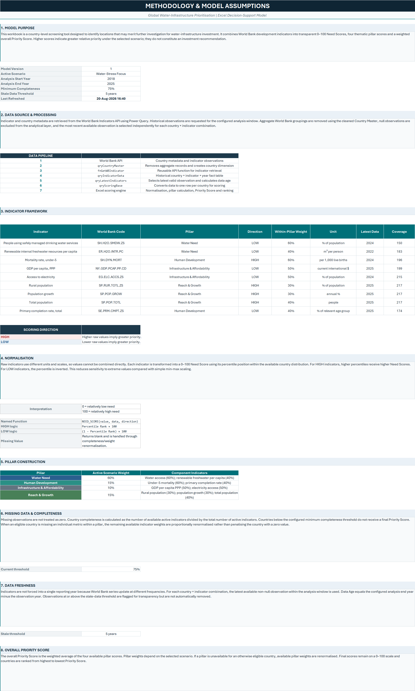

# Global Water Infrastructure Prioritisation

**Excel decision-support model for prioritising global water and infrastructure investment using World Bank development indicators, scenario weighting, data-quality controls, and dynamic country scoring.**



## Overview

This project is an interactive Microsoft Excel decision-support model designed to identify countries that may merit further investigation for water-infrastructure investment. It combines World Bank development indicators into transparent **0–100 Need Scores**, thematic pillar scores, and a weighted **Priority Score** that changes dynamically with the selected scenario.

The workbook is intended as a **screening and prioritisation tool**, not an automatic investment recommendation. Higher scores indicate greater relative priority for further analysis under the selected assumptions.

[**Download the Excel model**](Global_Water_Infrastructure_Prioritisation_Tool.xlsx)

## What the model does

- Retrieves country-level development data from the **World Bank Indicators API** using Power Query.
- Uses a reusable Power Query function to collect multiple indicators across the configured analysis window.
- Selects the **latest available non-null observation** independently for each country × indicator combination.
- Converts raw indicators with different units into comparable **0–100 percentile-based Need Scores**.
- Groups indicators into four decision pillars: **Water Need**, **Human Development**, **Infrastructure & Affordability**, and **Reach & Growth**.
- Applies scenario-driven pillar weights and recalculates country Priority Scores and rankings dynamically.
- Enforces a minimum data-completeness threshold and flags stale observations.
- Provides an executive dashboard, interactive country profiles, global/regional benchmarks, historical sparklines, scenario sensitivity analysis, and a global Filled Map.

## Dashboard

The executive dashboard provides a global view of the model, including the countries assessed, highest-priority country, highest Priority Score, median completeness, top-15 ranking, regional averages, selected-country profile, pillar scores, and global priority map.


## Country-level analysis

The Country Priority Profile allows the user to drill into an individual country and review:

- Global rank and Priority Score
- Data completeness and model eligibility
- Region and income classification
- Four pillar scores and weighted contributions
- Raw indicator values, observation years, Need Scores, direction, freshness, and historical trends
- Global and regional benchmark comparisons
- Scenario sensitivity across alternative weighting assumptions
- The contribution of each pillar to the current Priority Score



### Scenario sensitivity and score drivers

The model calculates the selected country's score under each predefined scenario without requiring the user to manually switch assumptions. This makes it possible to see whether a country's priority is robust or highly sensitive to the weighting framework.



## Model controls

The controls layer separates user assumptions from the analytical engine. Users can select a predefined scenario or define custom pillar weights, change the API analysis window, set the minimum completeness threshold, and change the stale-data threshold.



### Scenario weights

| Scenario | Water Need | Human Development | Infrastructure & Affordability | Reach & Growth |
|---|---:|---:|---:|---:|
| Base Case | 40% | 20% | 20% | 20% |
| Water-Stress Focus | 60% | 15% | 10% | 15% |
| Social-Impact Focus | 25% | 35% | 15% | 25% |
| Custom | User-defined | User-defined | User-defined | User-defined |

## Indicator framework

| Pillar | Indicator | World Bank code | Priority direction | Within-pillar weight |
|---|---|---|---|---:|
| Water Need | People using safely managed drinking water services | `SH.H2O.SMDW.ZS` | LOW | 60% |
| Water Need | Renewable internal freshwater resources per capita | `ER.H2O.INTR.PC` | LOW | 40% |
| Human Development | Mortality rate, under-5 | `SH.DYN.MORT` | HIGH | 60% |
| Human Development | Primary completion rate, total | `SE.PRM.CMPT.ZS` | LOW | 40% |
| Infrastructure & Affordability | GDP per capita, PPP | `NY.GDP.PCAP.PP.CD` | LOW | 50% |
| Infrastructure & Affordability | Access to electricity | `EG.ELC.ACCS.ZS` | LOW | 50% |
| Reach & Growth | Rural population | `SP.RUR.TOTL.ZS` | HIGH | 30% |
| Reach & Growth | Population growth | `SP.POP.GROW` | HIGH | 30% |
| Reach & Growth | Total population | `SP.POP.TOTL` | HIGH | 40% |

**Direction logic:** `HIGH` means higher raw values imply greater relative priority. `LOW` means lower raw values imply greater relative priority.

## Scoring methodology

### 1. Latest-observation selection

Indicators are not forced into a single reporting year because World Bank series update at different frequencies. For each country × indicator combination, the model selects the most recent available non-null observation within the configured analysis window and preserves the actual observation year.

### 2. Normalisation

Raw indicators are converted into a 0–100 relative Need Score using their percentile position within the available country distribution.

- `HIGH` indicators: higher percentile → higher Need Score.
- `LOW` indicators: percentile is inverted, so lower raw values → higher Need Score.
- `0` represents relatively low need within the available distribution.
- `100` represents relatively high need within the available distribution.

The Excel model implements this logic through a documented named `LAMBDA` function, `NEED_SCORE`, together with dynamic-array formulas.

### 3. Pillar construction

Indicator Need Scores are combined using within-pillar weights. Missing indicators are not treated as zero; available indicator weights are renormalised within a pillar.

### 4. Completeness and eligibility

Country completeness is calculated as the number of available active indicators divided by the total number of active indicators. Countries below the configured minimum-completeness threshold do not receive a final Priority Score.

### 5. Data freshness

`Data Age = Analysis End Year − Observation Year`.

Observations at or above the configured stale threshold are flagged for transparency but are not automatically removed.

### 6. Overall Priority Score

The final score is the weighted average of the four available pillar scores using the selected scenario. If a pillar is unavailable for an otherwise eligible country, the remaining pillar weights are renormalised. Countries are ranked from highest to lowest Priority Score.

## Data pipeline

```text
World Bank Indicators API
        ↓
qryCountryMaster
        ↓
fnGetWBIndicator
        ↓
qryIndicatorData
        ↓
qryLatestIndicators
        ↓
qryScoringBase
        ↓
Excel LAMBDA / LET / MAP scoring layer
        ↓
Dashboard + Country Detail + Methodology
```

Key Power Query components include:

- `qryCountryMaster` — cleans country metadata and removes World Bank aggregates.
- `fnGetWBIndicator` — reusable API retrieval function.
- `qryIndicatorData` — historical country × indicator × year dataset.
- `qryLatestIndicators` — selects latest valid observations and calculates freshness fields.
- `qryScoringBase` — pivots the latest observations into the country-level scoring base.

## Workbook structure

| Sheet | Purpose |
|---|---|
| `Start Here` | User guidance and model status |
| `Dashboard` | Executive global decision-support view |
| `Country Detail` | Interactive country-level drill-down |
| `Controls` | Scenario, weighting, completeness, and freshness assumptions |
| `Indicator Map` | Indicator configuration and data-availability monitoring |
| `Scoring` | Normalised scores, pillar calculations, Priority Score, ranking, and QA |
| `Country Master` | Cleaned country metadata |
| `PQ Data` | Historical Power Query output |
| `Methodology` | Model documentation, assumptions, and limitations |

## Methodology and transparency

The workbook contains a dedicated Methodology sheet documenting the source, data pipeline, scoring direction, normalisation, weighting, missing-data treatment, freshness controls, QA checks, and interpretation.



A text version is also available in [`docs/methodology.md`](docs/methodology.md).

## Technical features demonstrated

- Microsoft Excel decision-support modelling
- Power Query / M
- REST API ingestion and JSON processing
- Reusable Power Query functions
- Dynamic arrays
- `LAMBDA`, `LET`, `MAP`, `FILTER`, `XLOOKUP`, `SUMPRODUCT`, and ranking formulas
- Scenario and sensitivity analysis
- Missing-data and data-quality controls
- Dynamic charts and sparklines
- Filled Map and Geography-linked presentation elements
- Dashboard design and model documentation

## How to use

1. Download `Global_Water_Infrastructure_Prioritisation_Tool.xlsx` and open it in a recent desktop version of Microsoft Excel.
2. If prompted, enable data connections / connected experiences.
3. Use **Data → Refresh All** to retrieve the latest World Bank observations within the configured year window.
4. On the **Dashboard**, select a scenario and a country.
5. Review the global ranking and regional view, then use **Country Detail** for indicator-level diagnostics and scenario sensitivity.
6. Use **Controls** to change scenario assumptions, completeness requirements, freshness thresholds, or the API year window.

> The Power Query refresh requires an internet connection. Filled Maps, Geography-linked images, and some newer dynamic-array functions require a modern version of Microsoft Excel and may not render fully in alternative spreadsheet applications.

## Data source

Primary source: **World Bank World Development Indicators (WDI)** via the World Bank Indicators API.

- World Bank Indicators: https://data.worldbank.org/indicator
- World Bank API documentation: https://datahelpdesk.worldbank.org/knowledgebase/topics/125589-developer-information

## Limitations

- Priority Scores are **relative screening metrics**, not forecasts or causal estimates.
- Results depend on indicator availability, selected weights, and the configured analysis window.
- Percentile normalisation measures relative position within the available country distribution and does not represent an absolute engineering threshold.
- Stale observations are flagged rather than automatically excluded.
- Country-level data can conceal substantial subnational variation.
- The model does not include project costs, political risk, implementation feasibility, engineering constraints, or expected financial returns.

## Repository contents

```text
global-water-infrastructure-prioritisation/
├── README.md
├── Global_Water_Infrastructure_Prioritisation_Tool.xlsx
├── screenshots/
│   ├── dashboard.png
│   ├── country_detail.png
│   ├── Scenario_analysis.png
│   ├── controls.png
│   └── methodology.png
└── docs/
    └── methodology.md
```

## Disclaimer

This project is for analytical, educational, and portfolio purposes. Priority Scores indicate relative screening priority under the selected assumptions and available World Bank data; they should not be interpreted as an automatic recommendation to invest.
